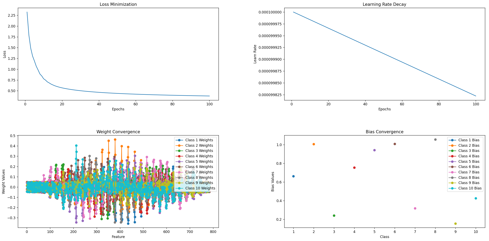

# Softmax Regression from Scratch


A minimal implementation of multinomial/softmax regression using only NumPy and Matplotlib. This project is designed for experimenting and understanding how softmax regression works under the hood.

## Overview

- **model.py**: Contains the `SoftmaxModel` class, which handles training, inference, parameter updates, and saving/loading model parameters.
- **plot.py**: Defines the `SoftmaxPlot` class for plotting loss, learning rate decay, weight convergence, and bias convergence.

## Installation

1. Clone this repository:
   ```bash
   git clone https://github.com/olsonb97/softmax_regression.git
   ```
2. Install dependencies:
   ```bash
   pip install -r requirements.txt
   ```

## Usage

1. Prepare your dataset and labels.
2. Create an instance of `SoftmaxModel` and call its `train` method:
   ```python
   from model import SoftmaxModel

   model = SoftmaxModel()
   model.train(
       dataset, 
       labels, 
       epochs=50, 
       batches=5, 
       learning_rate=0.01, 
       decay_rate=0.001, 
       shuffle=True, 
       plot=True
   )
   ```
3. Evaluate performance:
   ```python
   accuracy = model.test(dataset, labels)
   print("Accuracy:", accuracy)
   ```
4. Save or load model parameters:
   ```python
   model.save("my_params.npz")
   model.load("my_params.npz")
   ```

## Notes

- The `SoftmaxModel` class inherits from `SoftmaxPlot` to allow plotting of training metrics.
- This code is intended for educational and experimental purposes rather than production use.

## Contributing

Pull requests and issues are welcome for any improvements or suggestions.

## License

This project is released under the [MIT License](LICENSE).
